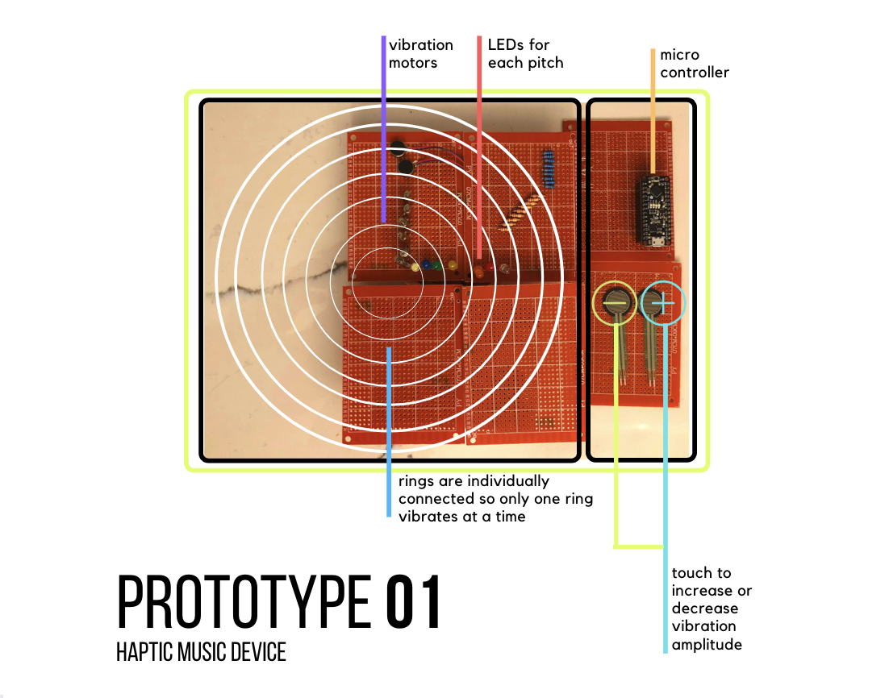

**Lois Lee's Final Project**

**Project Idea:**
Haptically and visually provide the amplitude and pitch of sounds.

**Team:**
Working solo!

**Rough form:**

**Expected parts:**
  1. Vibration motors
  2. LEDs
  3. Perfboards
  4. Adafruit Microcontroller
  5. Raspberry Pi
  6. FSR sensors (2)
  

**Interaction plan:** 
By putting one's hand so that they hit all of the rings, 
